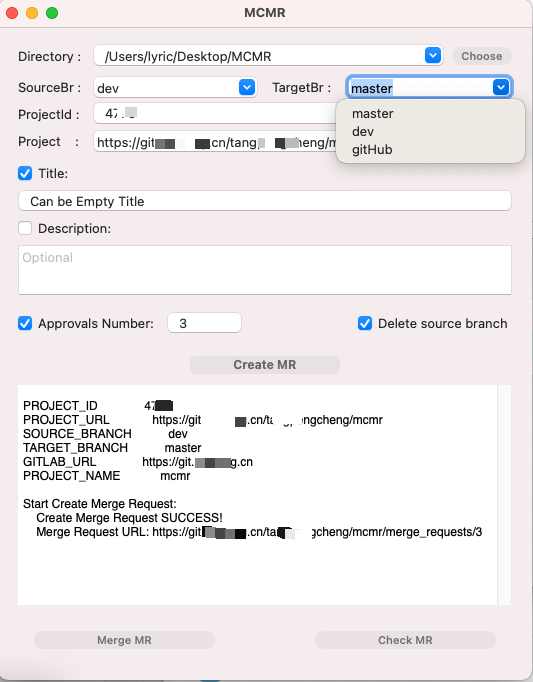
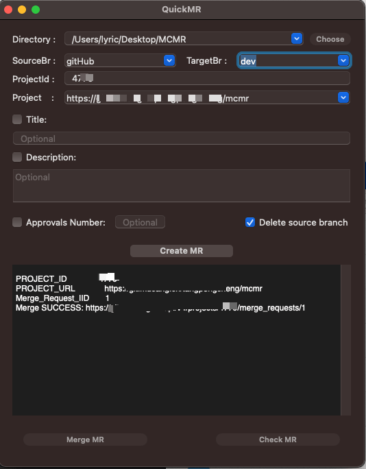
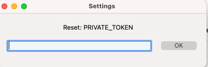

# QuickMR
### QUICK Create/Check/Merge a gitlab Merge Request
### 一键发起MR, 合并MR, 查看MR

Platform: MacOS 10.13+

#### 1. Set Gitlab PrivateToken:
relpace`{exampler}` to your host

#### 2. Choose Project Directory And Branch:
It will auto Get `Project` `ProjectId` `Branches of remote`

It will record last params after success create MR 

#### 3. Merge/Check MR:
merge and check can be used after create MR sucess

#### 4. Reset PrivateToken With Preference:

